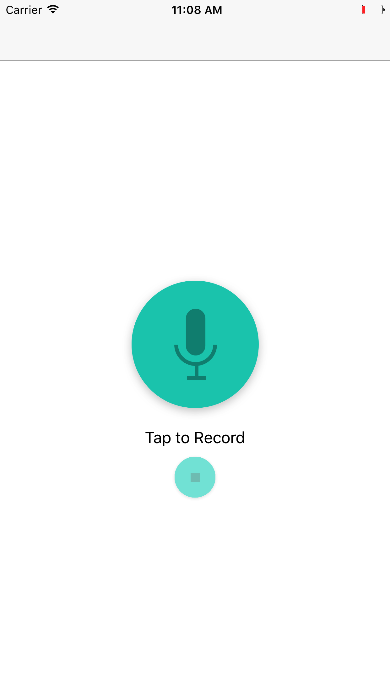
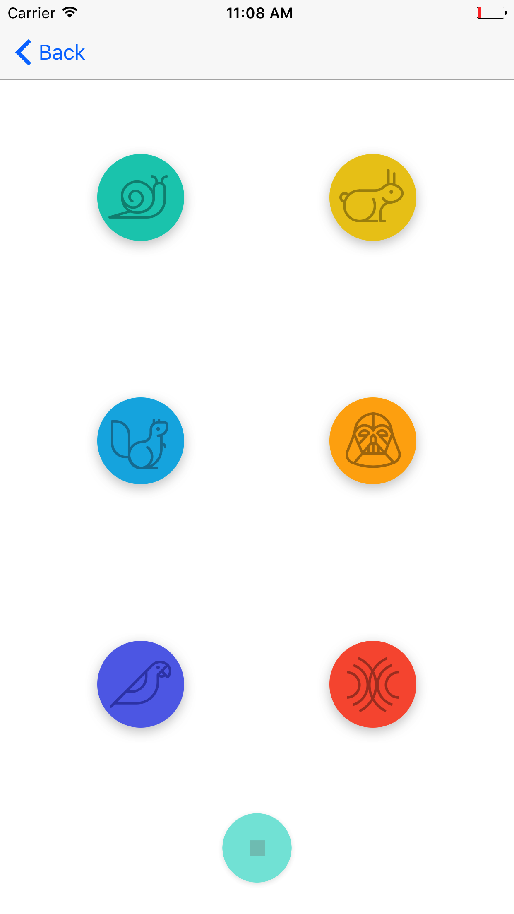

# PitchPerfect

A simple AVFoundation app that uses your phone's microphone to record audio and then apply audio effects on the recording: slow speed, high speed, low pitch, high pitch, Eco, and Reverb.

 
